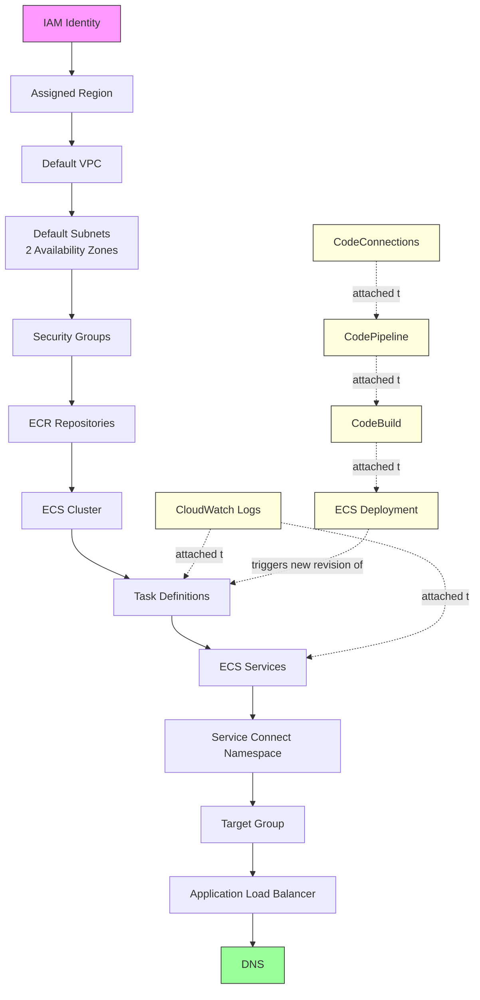
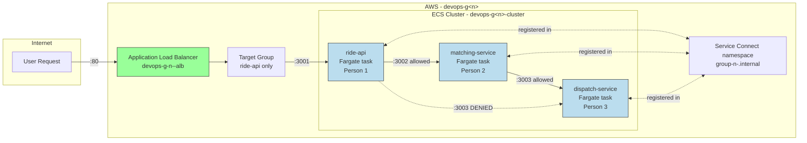

# ECS on Fargate — Dependency Graph (Gate 1)

This is the visual dependency graph for Phase 1. Each arrow means "must exist before."

## Reading this diagram

- **Solid arrows** = hard dependency chain (top to bottom). Each box cannot function until
  everything above it exists.
- **Dashed arrows** = supporting/automation systems that attach onto the main chain rather than
  sitting inside it — logging attaches to task definitions and services; the CI/CD chain
  (CodeConnections → CodePipeline → CodeBuild) ultimately produces new task definition revisions
  that ECS deploys.
- **Pink box (IAM Identity)** = the absolute floor; nothing happens without this.
- **Green box (DNS)** = the end of the chain; this is what a real user actually types/hits.
- **Yellow boxes** = the "Ship It" automation layer, separate from the "Host It / Wire It" chain
  above it, but ultimately feeding back into Task Definitions when a new deployment happens.

## Service-level detail (your three services + platform, mapped onto the graph)

This second diagram is the one worth showing live in the demo — it makes the "only ride-api is
public, matching-service and dispatch-service are internal-only, and ride-api cannot reach
dispatch-service directly" rule visually obvious at a glance.
