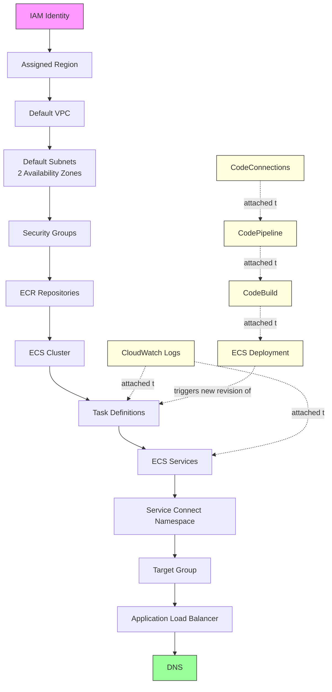
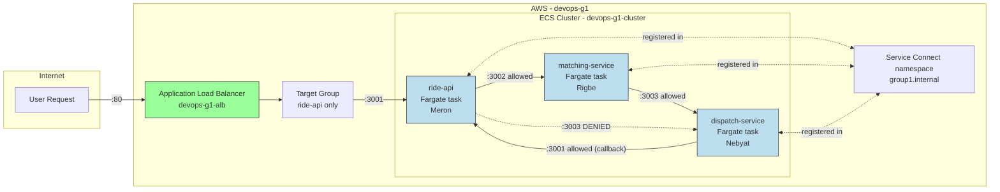

# ECS on Fargate — Team Submission

**Group number:** 1
**Assigned AWS region:** us-east-1
**AWS account ID:** 827478161993
**Resource naming prefix (applied to every resource):** `devops-g1-`

This document is Group 1's submission for the ECS on Fargate lab. It covers the team's Phase 1
planning (the dependency graph, traffic contracts, and design decisions agreed before any AWS
resource was created), how the three services were hosted and wired together, the CI/CD pipelines
each owner built, and the real failures encountered along the way.

---

## 1. What the services do

The system is the same three-service pipeline used in the team's local Docker Compose setup,
carried over to AWS under a ride-hailing theme. The architecture and behavior are identical to the
local version — only the names and hosting environment changed.

**Request flow:** `Client → Load Balancer → ride-api → matching-service → dispatch-service →
callback to ride-api`

- **ride-api** — the only publicly reachable service. Accepts a rider's request
  (`/request-ride`), starts the chain, and later receives a callback once dispatch-service has
  finished processing. This is the system's front door; everything else is internal-only.
- **matching-service** — receives the request from ride-api and is responsible for
  finding/validating a driver. Forwards the request to dispatch-service. Never reachable from the
  public internet.
- **dispatch-service** — receives the request from matching-service, performs the final
  assign/confirm step, and calls back to ride-api to report the outcome ("driver assigned"). Never
  reachable from the public internet, and never reachable directly from ride-api (only through
  matching-service).

Every service exposes:
- `/health` — reports its own status, and for ride-api/matching-service, whether the service it
  depends on is reachable
- `/metrics` — Prometheus-format metrics (request count, error count, latency)
- Structured JSON logs with a `request_id` and `trace_id`, so one request can be traced across all
  three services
- Lab-only failure endpoints (`/fail`, `/slow`, `/error`, `/dependency-fail`) used to deliberately
  break things during testing and the demo

The application code required no changes to move to AWS. What changed was *where* it runs (a
Fargate task instead of a local Docker container), *how* services find each other (AWS Service
Connect instead of Docker Compose's built-in DNS), and *what* sits in front of the system (an
Application Load Balancer instead of Nginx).

---

## 2. Locked decisions

| Decision | Value |
|---|---|
| Group number | 1 |
| Assigned AWS region | us-east-1 |
| AWS account ID | 827478161993 |
| Resource naming prefix | `devops-g1-` |
| Service Connect namespace | `group1.internal` |
| ride-api port | 3001 |
| matching-service port | 3002 |
| dispatch-service port | 3003 |
| ALB listener port | 80 |
| Health check path (all services) | `/health` |
| Git branch protection on `main` | PRs required, 1+ approval, no direct pushes |
| Image tagging rule | Git commit SHA — never `latest` |

**Required tags applied to every resource:**

| Key | Example |
|---|---|
| Project | `devops-mentorship` |
| Group | `group-1` |
| Owner | `ride-api-owner` / `matching-service-owner` / `dispatch-service-owner` / `platform-owner` |
| Environment | `lab` |

---

## 3. Roles

Each team member owned one service plus one fixed platform piece, for the entire lab, with no
rotation.

| Person | Role | Responsibilities |
|---|---|---|
| **Meron** | ride-api owner + platform owner | Image, ECR repo, task definition, security group, ECS service, pipeline for ride-api — plus the ECS cluster and Service Connect namespace |
| **Rigbe** | matching-service owner + platform owner | Image, ECR repo, task definition, security group, ECS service, pipeline for matching-service — plus the ALB and target group |
| **Nebyat** | dispatch-service owner + platform owner | Image, ECR repo, task definition, security group, ECS service, pipeline for dispatch-service — plus the CodeConnections setup |

**Why the platform role was split this way:** each shared piece was assigned to whoever's own
service work touched it earliest, so no one blocked on a handoff.

- Meron owned the ECS cluster and Service Connect namespace — needed earliest (Phase 2), so it
  was paired with the earliest-starting role.
- Rigbe owned the ALB and target group — needed once at least one service (ride-api) existed
  (Phase 3), so it was paired with a role that wasn't blocking anyone in Phase 2.
- Nebyat owned the CodeConnections setup — only needed in Phase 5, the last phase, so it was
  paired with the role with the most slack before it was needed.

Ownership did not change during implementation. Team members could advise another owner but did
not operate another owner's console — helping meant looking and suggesting, not taking over a
teammate's keyboard on resources that weren't theirs.

---

## 4. Phase 1 — Dependency graph and traffic contracts

No AWS resources were created until this section and the team's own internal Gate 1 review were
complete.

### 4.1 Dependency graph

```
IAM identity
    |
Assigned Region
    |
Default VPC
    |
Default subnets in two Availability Zones
    |
Security groups
    |
ECR repositories
    |
ECS cluster
    |
Task definitions
    |
ECS services
    |
Service Connect namespace
    |
Target group
    |
Application Load Balancer
    |
DNS
```

Attached to this chain: CloudWatch Logs, CodeConnections, CodePipeline, CodeBuild, ECS deployment.

**Visual version of the same chain:**



Solid arrows are the hard dependency chain (top to bottom) — each box cannot function until
everything above it exists. Dashed arrows are supporting/automation systems that attach onto the
main chain rather than sitting inside it — logging attaches to task definitions and services; the
CI/CD chain (CodeConnections → CodePipeline → CodeBuild) ultimately produces new task definition
revisions that ECS deploys. Pink (IAM Identity) is the absolute floor; green (DNS) is the end of
the chain — what a real user actually hits; yellow is the delivery automation layer, feeding back
into task definitions on every deployment.

**Service-level detail (the three services and platform pieces, mapped onto the graph):**



This diagram makes the core security rule visually clear: only ride-api is public,
matching-service and dispatch-service are internal-only, ride-api cannot reach dispatch-service
directly, but dispatch-service can call back to ride-api.

**Why this order matters:**

- **IAM identity** — nothing works without AWS first knowing who is asking. The absolute floor of
  the chain.
- **Assigned Region** — every resource lives inside exactly one region. Working in the wrong
  region silently produces resources nobody else on the team can see.
- **Default VPC + subnets in two AZs** — the two-AZ requirement isn't busywork: if one
  Availability Zone (effectively one physical data center) has an outage, the service keeps
  running in the other. This is the actual mechanism behind surviving a data-center failure.
- **Security groups** — must exist before a task launches, otherwise the task is either
  unreachable or dangerously open.
- **ECR repositories** — a container needs an image to run; nothing starts without one already
  pushed. Same role as Docker Hub in the local setup, just AWS's private version.
- **ECS cluster** — a logical grouping only; it does not run compute itself.
- **Task definitions** — the actual recipe (image, CPU/memory, port, permissions). Nothing runs
  without this existing first.
- **ECS services** — keeps N copies of a task definition running and replaces them if they die. A
  task definition alone is just a document; the service is what keeps something alive.
- **Service Connect namespace** — lets services find each other by name
  (`http://matching-service:3002`) instead of by ever-changing task IPs.
- **Target group + ALB + DNS** — the public door. The ALB needs a target group to know which
  tasks to send traffic to; DNS turns a human-readable address into the ALB's location.

**Team takeaway:** almost every real outage in a system shaped like this comes from one silently
broken link in this chain, not the whole system failing at once — a forgotten security group
rule, or a task role missing one permission. That is the practical meaning of "the cloud is a
dependency graph," and it is exactly what happened during Phase 3 (see Scar Log Entry 4).

### 4.2 Design decision: the dispatch-service → ride-api callback (C → A)

The design has dispatch-service (C) call ride-api (A) on `/driver-assigned` after a driver is
assigned. The assignment's contract permits only `Internet → ALB → A → B → C` and states no other
path should be permitted, so this is a deliberate, documented deviation, not an oversight.

**Rationale:** the callback confirms driver assignment back to the entry point that originated the
ride request. It is runtime and best-effort — ride-api does not depend on dispatch-service at
startup, so the "no startup cycle" contract still holds.

**What makes it defensible:**
- An explicit `dispatch-service SG → ride-api SG` rule on the callback port (Section 4.4).
- It is listed in the traffic contract as an intentional extra edge.
- This exact edge was missing from the team's first draft of the contract table, which caused a
  real, two-layer bug found and fixed live during Phase 3 wiring (Scar Log Entry 4).

**Grading note:** this sits in the "Traffic contracts and security design" band. It does not break
the explicit Gate 2 test (which proves A → C fails; C → A is a separate direction).

### 4.3 Dependency questions

| Question | Answer |
|---|---|
| What must exist before a Fargate task can start? | The task definition, the ECR image it references (already pushed), the execution role (permission to pull that image and write logs), and the networking setup (VPC/subnet/security group) it will run inside. |
| What must exist before ECS can pull an image? | The ECR repository with the image already pushed and tagged, and the task's execution role must have ECR pull permissions attached. |
| What must exist before the ALB can route traffic? | A target group with at least one healthy registered target, and a listener rule connecting the ALB's port to that target group. |
| What depends on the named container port? | The task definition's port-mapping name is referenced directly by Service Connect. If the Service Connect config and the task definition's port-mapping name don't match exactly, internal service-to-service calls fail silently even though everything looks "running." |
| Which resources survive task replacement? | The ECS service, the cluster, the security groups, the ALB, the target group, and the ECR image all persist. Only the task itself (the running container instance) is disposable and gets replaced. |
| Which resources generate cost while idle? | Fargate tasks (billed the whole time they run, whether or not they serve traffic) and the ALB (billed hourly just for existing, plus per request). The ECS cluster and security groups themselves cost nothing directly. |

### 4.4 Traffic contracts

`Internet → ALB → ride-api → matching-service → dispatch-service`, plus the documented
`dispatch-service → ride-api` callback. No other application path is permitted.

**Security-group matrix:**

| Source | Destination | Port | Allowed? | Enforcement |
|---|---|---|---|---|
| Internet | ALB | 80 | Yes | ALB security group |
| Internet | ride-api | 3001 | No | ride-api security group |
| Internet | matching-service | 3002 | No | matching-service security group |
| Internet | dispatch-service | 3003 | No | dispatch-service security group |
| ALB | ride-api | 3001 | Yes | ALB SG → ride-api SG |
| ride-api | matching-service | 3002 | Yes | ride-api SG → matching-service SG |
| ride-api | dispatch-service | 3003 | No | No matching rule |
| matching-service | dispatch-service | 3003 | Yes | matching-service SG → dispatch-service SG |
| dispatch-service | ride-api | 3001 | Yes (deliberate) | dispatch-service SG → ride-api SG (callback) |

**Per-pair agreements:**

| Pair | Protocol | Port | Service Connect name | SG reference | Health endpoint | Timeout |
|---|---|---|---|---|---|---|
| ALB → ride-api | HTTP | 3001 | ride-api | ALB SG → ride-api SG | /health | 5s |
| ride-api → matching-service | HTTP | 3002 | matching-service | ride-api SG → matching-service SG | /health | 5s |
| matching-service → dispatch-service | HTTP | 3003 | dispatch-service | matching-service SG → dispatch-service SG | /health | 5s |
| dispatch-service → ride-api (callback) | HTTP | 3001 | ride-api | dispatch-service SG → ride-api SG | /driver-assigned, /health | best-effort |

**Why 5 seconds:** this matches the `DOWNSTREAM_TIMEOUT=5` the services already used locally
(`docker-compose.yml`/`.env.example`) — no reason to invent a new value for AWS when the app
code's own timeout constant already defines it. Keeping it consistent means the local and AWS
environments fail the same way under the same conditions.

**Lab networking note:** tasks run in default public subnets with public IP assignment enabled
for outbound access. Public IP does not mean publicly permitted — security groups still block
direct inbound access to the application services. Private subnets/NAT Gateways/VPC endpoints
were out of scope for this lab.

**Why `ride-api → dispatch-service` is explicitly denied:** every service should only ever accept
traffic from one specific upstream neighbor — this mirrors what the local setup already did with
Docker's `internal: true` network, re-implemented with AWS security groups. The app's actual logic
never calls dispatch-service directly from ride-api (the flow is strictly A→B→C, never A→C).
Leaving that connection open would cost nothing today but would be a real least-privilege
weakness — if ride-api were ever compromised, an open A→C path would hand an attacker a direct
route to dispatch-service the architecture never intended to expose.

### 4.5 Ownership map and resource names

**Every resource, mapped to its owner:**

| Resource | Name | Owner |
|---|---|---|
| ECR — ride-api | `devops-g1-ride-api` | Meron |
| ECR — matching-service | `devops-g1-matching-service` | Rigbe |
| ECR — dispatch-service | `devops-g1-dispatch-service` | Nebyat |
| ECS cluster | `devops-g1-cluster` | Meron |
| Task definition — ride-api | `devops-g1-ride-api` (family) | Meron |
| Task definition — matching-service | `devops-g1-matching-service` (family) | Rigbe |
| Task definition — dispatch-service | `devops-g1-dispatch-service` (family) | Nebyat |
| ECS service — ride-api | `devops-g1-ride-api-svc` | Meron |
| ECS service — matching-service | `devops-g1-matching-service-svc` | Rigbe |
| ECS service — dispatch-service | `devops-g1-dispatch-service-svc` | Nebyat |
| Security group — ALB | `devops-g1-alb-sg` | Rigbe |
| Security group — ride-api | `devops-g1-ride-api-sg` | Meron |
| Security group — matching-service | `devops-g1-matching-service-sg` | Rigbe |
| Security group — dispatch-service | `devops-g1-dispatch-service-sg` | Nebyat |
| Service Connect namespace | `group1.internal` | Meron |
| CloudWatch log group — ride-api | `/ecs/devops-g1-ride-api` | Meron |
| CloudWatch log group — matching-service | `/ecs/devops-g1-matching-service` | Rigbe |
| CloudWatch log group — dispatch-service | `/ecs/devops-g1-dispatch-service` | Nebyat |
| ALB | `devops-g1-alb` | Rigbe |
| Target group | `devops-g1-ride-api-tg` | Rigbe |
| CodeConnections connection | `devops-g1-github-connection` | Nebyat |
| CodeBuild project — ride-api | `devops-g1-ride-api-build` | Meron |
| CodeBuild project — matching-service | `devops-g1-matching-service-build` | Rigbe |
| CodeBuild project — dispatch-service | `devops-g1-dispatch-service-build` | Nebyat |
| CodePipeline — ride-api | `devops-g1-ride-api-pipeline` | Meron |
| CodePipeline — matching-service | `devops-g1-matching-service-pipeline` | Rigbe |
| CodePipeline — dispatch-service | `devops-g1-dispatch-service-pipeline` | Nebyat |
| Shared S3 artifact bucket | `devops-g1-pipeline-artifacts` | Meron (shared infra, used by all three pipelines) |

### 4.6 Failure predictions

Three edges the team predicted failure modes for, before deployment:

| Broken edge | Expected user symptom | Expected AWS evidence |
|---|---|---|
| ECS task → ECR (wrong tag or missing pull permission) | Task never reaches RUNNING state | ECS console shows repeated STOPPED tasks; stopped reason mentions image pull failure |
| ALB target group → container port (wrong port number) | Requests to the ALB time out or return 502/503 | Target group shows targets as unhealthy; health check failing |
| ride-api → matching-service (Service Connect name mismatch) | Chain breaks after ride-api; request never completes | CloudWatch logs on ride-api show a connection/DNS failure trying to reach "matching-service" |

These predictions were confirmed against real behavior in Phase 4 — including a fourth,
unpredicted edge: the dispatch-service → ride-api callback, which failed first at the security
group layer, then again at the Service Connect DNS layer once the first fix was applied (Scar Log
Entry 4).

---

## 5. Sequencing — what blocked what

| Task | Required first | Owned by |
|---|---|---|
| Build and push a service's own Docker image to ECR | Nothing — independent | Each service owner |
| Create a service's own ECR repository | Nothing — independent | Each service owner |
| Create a service's own task definition | That service's image already pushed to ECR | Each service owner |
| Create a service's own ECS service | The ECS cluster must exist first | Meron (cluster) |
| Register a service under Service Connect | The Service Connect namespace must exist, and the service's own ECS service must exist | Meron (namespace) + service owner |
| Register ride-api with the public ALB | The ALB and target group must exist, and ride-api's own ECS service must be running | Rigbe (ALB/TG) + Meron (ride-api service) |
| Test ride-api → matching-service connectivity | Both services' ECS tasks running, both registered under Service Connect, both security groups created | Meron + Rigbe |
| Test matching-service → dispatch-service connectivity | Both services' ECS tasks running, both registered under Service Connect, both security groups created | Rigbe + Nebyat |
| Run Gate 2 (security proof) | All three services deployed and wired | Whole team |
| Set up a service's own CodeBuild/pipeline | The CodeConnections connection must exist and be authorized | Nebyat (connection) + service owner |
| Run Gate 3A (hands-off deploy) | Every owner's own pipeline working, and CodeConnections set up | Whole team |

**Practical consequence:** Meron built first (ride-api plus the ECS cluster and Service Connect
namespace), since most other steps depended on the cluster and namespace existing. Rigbe and
Nebyat built and pushed their own images and wrote their own task definitions in parallel — the
only genuinely blocked steps were creating the ECS service and wiring Service Connect, not the
earlier Docker/ECR steps.

---

## 6. Phase 2 — Hosting each service

**ride-api, resources created:**
- ECS cluster `devops-g1-cluster` (Fargate, Container Insights on)
- Service Connect namespace `group1.internal`
- ECR repo `devops-g1-ride-api` (immutable tags), image pushed and tagged by commit SHA
- Execution role `devops-g1-ecs-execution-role` (`AmazonECSTaskExecutionRolePolicy` attached)
- CloudWatch log group `/ecs/devops-g1-ride-api`
- Task definition `devops-g1-ride-api` (Fargate, 0.25 vCPU / 0.5 GB, named port mapping
  `ride-api`, task role added later for ECS Exec — see Scar Log Entry 2)
- Security group `devops-g1-ride-api-sg`, referencing the ALB's security group and, later,
  dispatch-service's security group for the callback — never a raw IP range

**Per-service-owner build steps (each owner did this for their own service):**

- Created an ECR repository (`devops-g1-<service>`) with `--image-tag-mutability IMMUTABLE`, so a
  tag can never be silently overwritten.
- Built each Docker image explicitly for `linux/amd64` — Fargate only runs amd64, and a plain
  `docker build` on Apple Silicon hardware produces an arm64 image by default, which fails to
  deploy (`CannotPullContainerError: image Manifest does not contain descriptor matching platform
  'linux/amd64'`) — encountered and documented as Scar Log Entry 1:
  ```bash
  docker buildx build --platform linux/amd64 \
    -t <account>.dkr.ecr.<region>.amazonaws.com/devops-g1-<service>:<git-sha> \
    -f services/<service>/Dockerfile \
    --push .
  ```
- Tagged every image with the Git commit SHA — never `latest`.
- Confirmed each service exposes its version via `/health`, e.g.
  `{ "service": "ride-api", "version": "a81f23c", "status": "ok" }`.
- Wrote each task definition for Fargate, `awsvpc` network mode, immutable ECR image, justified
  CPU/memory, named port mapping, CloudWatch Logs, health check, execution role, and a task role
  where needed.
- Created each ECS service: Fargate launch type, two default subnets in different Availability
  Zones, the service's own dedicated security group, public IP enabled, deployment circuit
  breaker enabled, automatic rollback enabled, ECS Exec enabled. Desired count: 2 for ride-api
  (the only publicly reachable service), 1 each for matching-service and dispatch-service.
- Verified ECS Exec on each service via `aws ecs execute-command --interactive --command "/bin/sh"`.
- Confirmed each per-service checkpoint: task state RUNNING, container health HEALTHY, CloudWatch
  log visible, current Git SHA visible, ECS Exec succeeding.

**Platform-owner build steps:**

- Created the ECS cluster `devops-g1-cluster`.
- Confirmed the default VPC and subnets across two Availability Zones.
- Prepared the Service Connect namespace and the ALB/target group ahead of full wiring in Phase 3.

---

## 7. Phase 3 — Wiring the system

- Created the Service Connect namespace `group1.internal` and registered all three services under
  it using the agreed names.
- Confirmed application code calls downstream services by Service Connect name, never by task IP
  (`ride-api → http://matching-service:3002`, `matching-service → http://dispatch-service:3003`).
- Verified port-mapping names matched the Service Connect configuration, and destination security
  groups allowed the correct ports.
- Verified `X-Request-ID` correlation survives the AWS hop between services.
- Created the four security groups, each referencing the previous group in the chain rather than
  IP ranges.
- Created the ALB: internet-facing, two Availability Zones, HTTP listener on port 80, target
  group type `ip`, only ride-api registered, health-check path `/health`.
- Confirmed matching-service and dispatch-service have no public target groups.

### Gate 2 — Runtime and security proof

Positive tests (confirmed to succeed):

| Test | Where executed |
|---|---|
| Internet → ALB | Engineer machine |
| ALB → ride-api | Through public request |
| ride-api → matching-service | Inside ride-api task (ECS Exec) |
| matching-service → dispatch-service | Inside matching-service task (ECS Exec) |

Negative tests (confirmed to fail/deny):

| Test | Where executed |
|---|---|
| Internet → ride-api app port | Engineer machine |
| Internet → matching-service app port | Engineer machine |
| Internet → dispatch-service app port | Engineer machine |
| ride-api → dispatch-service | Inside ride-api task (ECS Exec) |

Evidence used: ECS Exec command output, security-group rules, CloudWatch Logs, ECS service
events.

Gate 2 was proven with both configuration and live runtime behavior, not one or the other.

---

## 8. Phase 4 — Proving the system operates

A real request was traced end to end: DNS → ALB listener → target group → ride-api → Service
Connect → matching-service → Service Connect → dispatch-service, with the resource permitting each
hop, the destination port, and the evidence it occurred all recorded and checked against the
Phase 1 predictions.

### Sabotage round

Each service owner introduced one secret failure into their own service, from a shared list
(wrong health-check path, wrong container port, missing Service Connect name, blocking
security-group rule, application bound to `localhost`, nonexistent image tag, insufficient
memory, public IP disabled, incorrect execution role). Investigators diagnosed each fault from
evidence alone — ECS service events, stopped-task reasons, ALB target health, CloudWatch Logs,
task-definition revisions, security-group rules — with no console takeover and no repair before
the root cause was stated aloud. Each sabotage became a scar-log entry.

### Kill-a-task test

With continuous traffic running against the ALB, one ride-api task was stopped deliberately and
the team recorded failed requests, non-200 responses, replacement start time, target
registration, target health transition, and recovery time.

**Findings, confirmed against the team's Phase 1 predictions:**

1. **Why ECS replaced the task:** the ECS service's desired count is a standing instruction ("keep
   N of these running at all times"), not a one-time action. The moment a task stops, ECS notices
   the running count no longer matches the desired count and starts a replacement automatically.
2. **How the ALB avoided an unhealthy target:** the target group's own health check polls
   `/health` independently of ECS. The instant the stopped task fails to respond, the ALB marks
   that target unhealthy and stops sending it requests — traffic shifted to the remaining healthy
   task before the replacement task even finished starting.
3. **Service Connect required no reconfiguration:** it resolves the service name (`ride-api`) to
   whichever healthy tasks currently exist, not to a fixed task IP. The replacement task
   registered itself under the same name automatically.
4. **Why ride-api runs at desired count 2 while the other two run at 1:** with desired count 2,
   there is always a second task already healthy to absorb traffic the instant one dies — close to
   zero failed requests observed. With desired count 1, there is no standby, so every request
   arriving during the replacement gap fails or times out. This is why ride-api, the only publicly
   reachable service, is set to 2.

---

## 9. Phase 5 — Hands-off delivery

### Platform work

- Created and authorized one CodeConnections connection (`devops-g1-github-connection`) for the
  group repository, reused by all three service pipelines.
- Confirmed connection status `available`, correct repository authorized, source branch `main`.
- Enabled branch protection on `main`: pull requests required, at least one approval required,
  direct pushes blocked.

### Per-service pipeline work

- Each owner created their own CodeBuild project using `buildspecs/<service>.yml`.
- Each buildspec runs tests, builds the correct image, tags it with the commit SHA, pushes to the
  service's own ECR repository, and produces `imagedefinitions.json`.
- Privileged mode was enabled on every CodeBuild project (required for Docker builds).
- Each `imagedefinitions.json` container name matches its ECS task-definition container name
  exactly, e.g.:
  ```json
  [{ "name": "ride-api",
     "imageUri": "827478161993.dkr.ecr.us-east-1.amazonaws.com/devops-g1-ride-api:<sha>" }]
  ```
- IAM roles were scoped minimally: a CodeBuild role (read source, write logs, authenticate to and
  push to ECR), a CodePipeline role (invoke CodeBuild, read artifacts, deploy to ECS), an ECS
  execution role (pull images, send logs), and an ECS task role (runtime permissions, ECS Exec
  support). No unrestricted `iam:PassRole` — each pipeline's role is scoped to the exact ECS
  task/execution roles it deploys.

### Gate 3A — Hands-off deployment

A visible service version change was merged into `main`. After the merge, no manual deployment
action was taken.

| Stage | Evidence |
|---|---|
| Pull request | Reviewed and approved |
| Commit | Git SHA recorded |
| Source stage | Triggered automatically |
| CodeBuild | Correct service built |
| ECR | SHA-tagged image pushed |
| Build artifact | Correct `imagedefinitions.json` |
| ECS deploy | New revision deployed |
| Runtime | New SHA visible through the ALB |

Confirmed for ride-api: Source, Build, and Deploy stages all succeeded automatically from a single
merge to `main`, deploying task definition revision 4 with zero manual `aws ecs update-service`
calls.

### Gate 3B — Automatic rollback

A revision was deployed that deliberately failed its health check, to prove the deployment
circuit breaker catches and reverts a bad deployment automatically.

For ride-api: a task definition revision was registered with its health check pointed at a
nonexistent path. ECS started new tasks under that revision, which failed their health checks
repeatedly (`stoppedReason: "Task failed container health checks"`). After enough failures, the
circuit breaker triggered automatically (`rolloutStateReason: "ECS deployment circuit breaker:
rolling back to deploymentId ecs-svc/8392534737912615571"`), reverting the service to the last
known-good revision. The two previously-running healthy tasks continued serving traffic the
entire time — zero user-visible impact.

---

## 10. Phase 6 — Handoff and cleanup

### Cost sweep

| Resource | Bills while idle? | Cleanup required? |
|---|---|---|
| Fargate tasks | Yes | Yes |
| Application Load Balancer | Yes | Yes |
| CodeBuild | Per build | No persistent compute |
| CodePipeline | Possible pipeline cost | As instructed |
| ECR images | Storage | As instructed |
| CloudWatch Logs | Ingestion and storage | As instructed |
| Container Insights | Metrics usage | As instructed |
| Security groups | No direct cost | Yes |
| ECS cluster | No direct cost | Yes |
| Default VPC | No direct cost | Never delete |

**Most expensive resource likely to be forgotten:** the Application Load Balancer. Fargate tasks
stop billing the moment a service is scaled to 0 or deleted, but the ALB bills a flat hourly rate
for existing at all, plus a per-processed-byte charge, whether or not it's receiving traffic. This
is why the cleanup order below puts the ALB high on the list.

### Cleanup order

```
Pipelines
  -> ECS services
  -> Application Load Balancer
  -> Target groups
  -> ECS cluster
  -> Custom security groups
  -> CloudWatch log groups
  -> ECR repositories (only if instructed)
```

Never deleted: default VPC, default subnets, default route table, default Internet Gateway,
shared Route 53 zones, another group's resources.

---

## 11. Scar log

A clean or empty scar log is not treated as a strong result — the instructor treats a lack of
documented failures as a red flag, not a sign of a smooth build. Every real failure encountered is
logged below, including the small ones.

### Entry 1 — ride-api — image failed to pull on Fargate

| Field | Entry |
|---|---|
| Symptom | `aws ecs create-service` succeeded and the service showed `ACTIVE`, but `runningCount` stayed at 0 indefinitely. Desired count was 2, actual running count never moved off 0 after several minutes. |
| First hypothesis | Assumed it was a permissions problem — that the execution role couldn't pull from ECR, or was missing a permission. |
| Evidence | `aws ecs describe-services ... --query 'services[0].events[0:5]'` showed the real message directly: `CannotPullContainerError: pull image manifest has been retried 7 time(s): image Manifest does not contain descriptor matching platform 'linux/amd64'.` This ruled out the permissions hypothesis immediately — a permissions failure gives a distinct access-denied error, not a missing-platform error. |
| Actual cause | The image was built locally with a plain `docker build` on Apple Silicon (arm64) hardware. Docker defaults to building for the host machine's own architecture, so the pushed image only had an arm64 manifest. AWS Fargate only runs `linux/amd64` images by default — ECS could see the image in ECR, but had no compatible manifest to run. |
| Repair | Rebuilt the image explicitly targeting the correct platform: `docker buildx build --platform linux/amd64 -t <ecr-uri>:<tag>-amd64 -f services/ride-api/Dockerfile --push .` — verified the pushed manifest actually contained `Platform: linux/amd64` via `docker buildx imagetools inspect` before wiring it into a new task definition revision, then force-deployed the ECS service onto that corrected revision. |
| Prevention | Build container images destined for Fargate with an explicit `--platform linux/amd64` flag when developing on Apple Silicon hardware — never rely on the platform-less default `docker build`, since it silently succeeds locally and only fails once it reaches AWS. |

### Entry 2 — ride-api — ECS Exec required a task role, not just an execution role

| Field | Entry |
|---|---|
| Symptom | `aws ecs create-service ... --enable-execute-command` failed immediately with `InvalidParameterException: The service couldn't be created because a valid taskRoleArn is not being used.` |
| First hypothesis | Assumed the task definition simply didn't need a task role at all, since ride-api's own application code makes no direct AWS API calls — only plain HTTP calls to matching-service. |
| Evidence | The error was explicit about needing a `taskRoleArn`, not an execution-role problem — and AWS's own ECS Exec documentation confirms the SSM session channel used by `execute-command` requires permissions (`ssmmessages:CreateControlChannel`, etc.) that must live on the task role, separate from the execution role's image-pull/logging permissions. |
| Actual cause | Conflated "does the application need AWS permissions" with "does the task need AWS permissions." ECS Exec itself is a feature the task uses (to let AWS's Session Manager attach a shell into the running container), independent of whether the application code inside ever calls an AWS API directly. |
| Repair | Created a dedicated task role (`devops-g1-ride-api-task-role`) with an inline policy granting exactly the four `ssmmessages:*` actions ECS Exec needs, attached it as `taskRoleArn` in the task definition, registered a new revision, and re-created the service successfully. |
| Prevention | When a task definition enables `enableExecuteCommand`, create a minimal task role with the SSM messaging permissions up front, even if the application itself needs no other AWS access. |

### Entry 3 — ride-api — `aws ecs execute-command` failed locally with a missing plugin

| Field | Entry |
|---|---|
| Symptom | After the task role fix (Entry 2), running `aws ecs execute-command --interactive ...` from a local machine failed immediately with `SessionManagerPlugin is not found.` — no connection was attempted at all. |
| First hypothesis | Assumed the ECS Exec setup on the AWS side was still wrong. |
| Evidence | The error message pointed directly at a local, client-side tool, not an AWS-side permission or configuration problem — IAM/permissions failures return a distinct `AccessDenied`/`InvalidParameterException`-style error, not "plugin not found." |
| Actual cause | `aws ecs execute-command` relies on a separate program — the Session Manager plugin — installed alongside the AWS CLI on the engineer's own machine. It was never installed on this machine. |
| Repair | Installed the plugin (`brew install --cask session-manager-plugin`), confirmed it was on `PATH`, then re-ran the exact same `execute-command`, which succeeded and returned real output from inside the running container. |
| Prevention | Install the Session Manager plugin on every team member's machine before anyone attempts ECS Exec. |

### Entry 4 — traffic contract table missed the callback leg, exposing a second layered bug

| Field | Entry |
|---|---|
| Symptom | A real end-to-end request through the ALB (`GET /request-ride`) returned `502 Matching service unreachable`, even though `/health` reported `matching-service: ok` and every individual service looked healthy. |
| First hypothesis | Looked like a matching-service problem, since that's the error ride-api surfaced. |
| Evidence | Traced the same `request_id` across CloudWatch logs for all three services in order. ride-api → matching-service: succeeded. matching-service → dispatch-service: succeeded. dispatch-service → ride-api callback (`POST /driver-assigned`): failed. The failure two hops away was masking as a matching-service error at the front of the chain. |
| Actual cause (layer 1) | The traffic contract table only modeled the forward request chain (ALB→ride-api→matching-service→dispatch-service) and never listed the callback edge (dispatch-service→ride-api). No security group rule existed allowing dispatch-service's SG to reach ride-api on port 3001, so the callback was blocked at the network layer. |
| Repair (layer 1) | Added an ingress rule on `ride-api-sg` allowing port 3001 from `dispatch-service-sg`. Confirmed via `describe-security-groups` that the rule was present. |
| Actual cause (layer 2) | Re-testing the same end-to-end request after the security group fix still failed, with a different, more specific error from dispatch-service's own logs: `NameResolutionError("Failed to resolve 'ride-api' ([Errno -2] Name or service not known)")`. This was DNS resolution failing inside Service Connect, not a firewall block — a second, independent bug hidden behind the first one. |
| Repair (layer 2) | Corrected dispatch-service's Service Connect / Cloud Map wiring so it could resolve `ride-api` by name inside the `group1.internal` namespace. |
| Prevention | When modeling traffic contracts, explicitly check for callback/response paths, not just the forward request chain. Don't stop testing after the first fix resolves the symptom's error message — re-run the actual end-to-end request and read the next hop's logs, since a second unrelated bug can be hiding directly behind the first one. |

---

## 12. Live demo plan

- **Demo 1** — each owner presents, 5 minutes: ECR and current image SHA, task definition, ECS
  service, security group, a CloudWatch log line, ECS Exec access, delivery pipeline, running
  version. Each owner is prepared to answer one question about a teammate's service.
- **Demo 2** — trace one live request end to end, as a team, with the same correlation ID visible
  in all three services.
- **Demo 3** — prove all security boundaries live (allow and deny cases).
- **Demo 4** — live failure diagnosis of an instructor-injected fault (symptom → hypothesis →
  evidence → root cause → repair → scar log entry).
- **Demo 5** — live availability test (stop a task while continuous traffic runs).
- **Demo 6** — live hands-off deployment (merge to `main`, zero manual steps after).
- **Demo 7** — live rollback demonstration.
- **Demo 8** — present the team's single best scar-log entry (clearest learning, not necessarily
  the most complex failure).

---

## 13. Scoring awareness

| Condition | Maximum score |
|---|---|
| One person controls most of the implementation | 70% |
| Gate 2 security boundaries not proven | 75% |
| No scar log or weak evidence | 70% |
| No hands-off deployment | 80% |
| Manual intervention required after merge | 85% |
| No rollback demonstration | 90% |
| Billable resources left running after cleanup deadline | 80% |
| Another group's resources modified or deleted | Review required |

A working application alone is not sufficient — the submission demonstrates ownership, security,
evidence, recovery, and delivery, each independently.
